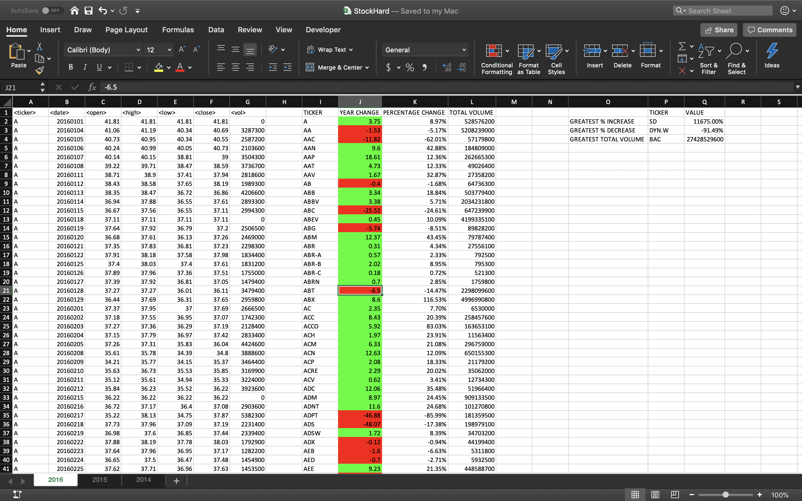
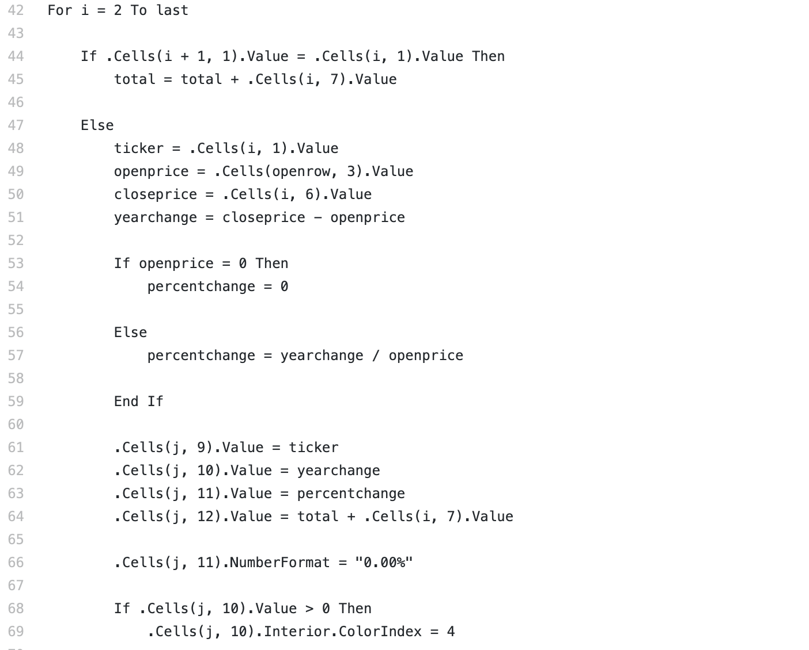

# Project Preview

Some data can be quite overwhelming to digest. In this data-cleaning project, I attempt to use basic-advanced excel skills to make data clearer and easier to read. Using VBA coding methods, I analyze stock market BIG Data statistics to answer questions compelled by the assignment.

-----------------------------------------------------------------------------------------------------------

# ANALYZING STOCK MARKET DATA: 2014, 2015, & 2016

-----------------------------------------------------------------------------------------------------------

-----------------------------------------------------------------------------------------------------------

-----------------------------------------------------------------------------------------------------------
